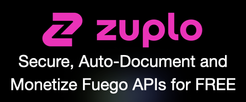

<!-- markdownlint-disable MD041 -->
<p align="center">
  
</p>

# Fuego 🔥

[](https://pkg.go.dev/github.com/go-fuego/fuego)
[](https://goreportcard.com/report/github.com/go-fuego/fuego)
[](https://coveralls.io/github/go-fuego/fuego?branch=main)
[](https://discord.gg/9csuB6WNsq)

> The framework for busy Go developers

🚀 **Explore and contribute to our [2025 Roadmap](https://github.com/go-fuego/fuego/discussions/263)!** 🚀

Production-ready Go API framework generating OpenAPI documentation from code.
Inspired by Nest, built for Go developers.

Also empowers templating with `html/template`, `a-h/templ` and `maragudk/gomponents`:
see [the example](./examples/full-app-gourmet) [running live](https://gourmet.quimerch.com).

## Sponsors

Fuego is proudly sponsored by [Zuplo](https://zuplo.link/fuego-gh),
that provides [a Fuego integration](https://zuplo.link/fuego-gh)!

<div align="center">
	
</div>

> Zuplo allows you to secure your Fuego API, scale it globally,
> generate documentation from your OpenAPI, and monetize your users.

## Why Fuego?

Chi, Gin, Fiber and Echo are great frameworks.
But since they were designed a long time ago,
[their current API does not allow them][gin-gonic-issue] to deduce
OpenAPI types from signatures, things that are now possible with generics.
Fuego offers a lot of "modern Go based" features that make it easy
to develop APIs and web applications.

## Features

- **OpenAPI**: Fuego automatically generates OpenAPI documentation
  from **code** - _not from comments nor YAML files!_
- **100% `net/http` compatible** (no lock-in): Fuego is built on top of `net/http`,
  so you can use any `http.Handler` middleware or handler! Fuego also supports
  `log/slog`, `context` and `html/template`.
- **Routing**: Fuego router is based on Go 1.22 `net/http`, with grouping and
  middleware support
- Optional trailing slash handling: Configure whether `/users` and `/users/` should be treated as the same route
- **Serialization/Deserialization**: Fuego automatically serializes and
  deserializes JSON, XML and HTML Forms based on user-provided structs
  (or not, if you want to do it yourself)
- **Validation**: Fuego provides a simple and fast validator based on `go-playground/validator`
- **Transformation**: easily transform your data by implementing the
  `fuego.InTransform` and `fuego.OutTransform` interfaces - also useful for
  custom **validation**
- **Middlewares**: easily add a custom `net/http` middleware
  or use the provided middlewares.
- **Error handling**: Fuego provides centralized error handling with
  the standard [RFC 9457](https://www.rfc-editor.org/rfc/rfc9457).
- **Rendering**: Fuego provides a simple and fast rendering system based on
  `html/template` - you can still also use your own template system like
  `templ` or `gomponents`
- **Adaptors**: Fuego can be plugged to an existing Gin or Echo server to
  generate OpenAPI documentation

## Configuration

### Trailing Slashes

By default, Fuego treats URLs with and without trailing slashes as distinct routes. You can configure the server to automatically strip trailing slashes using the `WithStripTrailingSlash` option:

```go
s := fuego.NewServer(
    fuego.WithStripTrailingSlash(),
)
```

When enabled:

- `/api/users` and `/api/users/` will route to the same handler
- Routes registered with trailing slashes are automatically converted to non-trailing slash versions
- Improves URL consistency across your API

## Examples

### Hello World

```go
package main

import "github.com/go-fuego/fuego"

func main() {
	s := fuego.NewServer()

	fuego.Get(s, "/", func(c fuego.ContextNoBody) (string, error) {
		return "Hello, World!", nil
	})

	s.Run()
}
```

### Simple POST

```go
package main

import "github.com/go-fuego/fuego"

type MyInput struct {
	Name string `json:"name" validate:"required"`
}

type MyOutput struct {
	Message string `json:"message"`
}

func main() {
	s := fuego.NewServer()

	// Automatically generates OpenAPI documentation for this route
	fuego.Post(s, "/user/{user}", myController)

	s.Run()
}

func myController(c fuego.ContextWithBody[MyInput]) (*MyOutput, error) {
	body, err := c.Body()
	if err != nil {
		return nil, err
	}

	return &MyOutput{Message: "Hello, " + body.Name}, nil
}
```

### With transformation & custom validation

```go
type MyInput struct {
	Name string `json:"name" validate:"required"`
}

// Will be called just before returning c.Body()
func (r *MyInput) InTransform(context.Context) error {
	r.Name = strings.ToLower(r.Name)

	if r.Name == "fuego" {
		return errors.New("fuego is not a valid name for this input")
	}

	return nil
}
```

### More OpenAPI documentation

```go
package main

import (
	"github.com/go-fuego/fuego"
	"github.com/go-fuego/fuego/option"
	"github.com/go-fuego/fuego/param"
)

func main() {
	s := fuego.NewServer()

	// Custom OpenAPI options
	fuego.Post(s, "/", myController,
		option.Description("This route does something..."),
		option.Summary("This is my summary"),
		option.Tags("MyTag"), // A tag is set by default according to the return type (can be deactivated)
		option.Deprecated(),  // Marks the route as deprecated in the OpenAPI spec

		option.Query("name", "Declares a query parameter with default value", param.Default("Carmack")),
		option.Header("Authorization", "Bearer token", param.Required()),
		optionPagination,
		optionCustomBehavior,
	)

	s.Run()
}

var optionPagination = option.Group(
	option.QueryInt("page", "Page number", param.Default(1), param.Example("1st page", 1), param.Example("42nd page", 42)),
	option.QueryInt("perPage", "Number of items per page"),
)

var optionCustomBehavior = func(r *fuego.BaseRoute) {
	r.XXX = "YYY"
}
```

### Std lib compatibility

```go
package main

import (
	"net/http"

	"github.com/go-fuego/fuego"
)

func main() {
	s := fuego.NewServer()

	// Standard net/http middleware
	fuego.Use(s, func(next http.Handler) http.Handler {
		return http.HandlerFunc(func(w http.ResponseWriter, r *http.Request) {
			w.Header().Set("X-Hello", "World")
			next.ServeHTTP(w, r)
		})
	})

	// Standard net/http handler with automatic OpenAPI route declaration
	fuego.GetStd(s, "/std", func(w http.ResponseWriter, r *http.Request) {
		w.Write([]byte("Hello, World!"))
	})

	s.Run()
}
```

### Real-world examples

Please see the [`/examples` folder](./examples/) for more examples.

- [Simple CRUD with OpenAPI](./examples/petstore)
- [Full app with HTML rendering](./examples/full-app-gourmet)

<details>
<summary>All features</summary>

```go
package main

import (
	"context"
	"errors"
	"net/http"
	"strings"

	chiMiddleware "github.com/go-chi/chi/v5/middleware"
	"github.com/go-fuego/fuego"
	"github.com/rs/cors"
)

type Received struct {
	Name string `json:"name" validate:"required"`
}

type MyResponse struct {
	Message       string `json:"message"`
	BestFramework string `json:"best"`
}

func main() {
	s := fuego.NewServer(
		fuego.WithAddr("localhost:8088"),
	)

	fuego.Use(s, cors.Default().Handler)
	fuego.Use(s, chiMiddleware.Compress(5, "text/html", "text/css"))

	// Fuego 🔥 handler with automatic OpenAPI generation, validation, (de)serialization and error handling
	fuego.Post(s, "/", func(c fuego.ContextWithBody[Received]) (MyResponse, error) {
		data, err := c.Body()
		if err != nil {
			return MyResponse{}, err
		}

		c.Response().Header().Set("X-Hello", "World")

		return MyResponse{
			Message:       "Hello, " + data.Name,
			BestFramework: "Fuego!",
		}, nil
	})

	// Standard net/http handler with automatic OpenAPI route declaration
	fuego.GetStd(s, "/std", func(w http.ResponseWriter, r *http.Request) {
		w.Write([]byte("Hello, World!"))
	})

	s.Run()
}

// InTransform will be called when using c.Body().
// It can be used to transform the entity and raise custom errors
func (r *Received) InTransform(context.Context) error {
	r.Name = strings.ToLower(r.Name)
	if r.Name == "fuego" {
		return errors.New("fuego is not a name")
	}
	return nil
}

// OutTransform will be called before sending data
func (r *MyResponse) OutTransform(context.Context) error {
	r.Message = strings.ToUpper(r.Message)
	return nil
}
```

```bash
curl http://localhost:8088/std
# Hello, World!
curl http://localhost:8088 -X POST -d '{"name": "Your Name"}' -H 'Content-Type: application/json'
# {"message":"HELLO, YOUR NAME","best":"Fuego!"}
curl http://localhost:8088 -X POST -d '{"name": "Fuego"}' -H 'Content-Type: application/json'
# {"error":"cannot transform request body: cannot transform request body: fuego is not a name"}
```

</details>

## From net/http to Fuego in 10s

<https://github.com/go-fuego/fuego/assets/46993939/7438a71c-75a4-4e88-a584-71da6362c575>

<details>
<summary>Views</summary>

### Before


#### After


#### Diff


#### Benefits of using Fuego views (controllers returning HTML)

- Never forget to return after an error
- OpenAPI schema generated, listing all the routes
- Deserialization and validation are easier
- Transition to Fuego is easy and fast

</details>

## Contributing

See the [contributing guide](CONTRIBUTING.md).
Thanks to [everyone who has contributed][contributors-url] to this project! ❤️

<a href="https://github.com/go-fuego/fuego/graphs/contributors">
  
</a>

<small>Made with [contrib.rocks](https://contrib.rocks)</small>

## Roadmap

See the [board](https://github.com/orgs/go-fuego/projects/1).

## Disclaimer for experienced gophers

I know you might prefer to use `net/http` directly,
but if having a frame can convince my company to use
Go instead of Node, I'm happy to use it.

## License

[MIT](./LICENSE.txt)

[gin-gonic-issue]: https://github.com/gin-gonic/gin/issues/155
[contributors-url]: https://github.com/go-fuego/fuego/graphs/contributors
