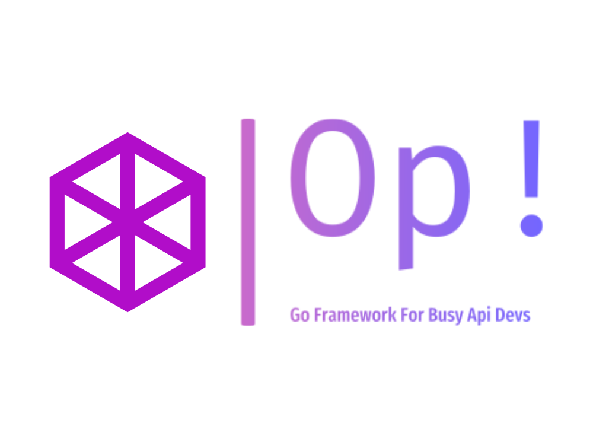

<p align="center">
  
</p>

# Op! ⏱️

[](https://pkg.go.dev/github.com/go-op/op)
[](https://goreportcard.com/report/github.com/go-op/op)

> The Go framework for busy API developers

The only Go framework generating OpenAPI documentation from code. The modern NestJS for Go. But also completely different.

## Why op?

Chi, Gin, Fiber and Echo are great frameworks. But since they are designed a long time ago, they do not enjoy the possibilities that provide modern Go. Op provides a lot of helper functions and features that make it easy to develop APIs.

- [x] **Simple**: Op is easy to learn and use
- [x] **OpenAPI**: Automatically generates OpenAPI documentation
- [x] **Fast**: Op is built for performance
- [x] **Compatible**: Op is built on top of stdlib
- [x] **Flexible**: Op is highly configurable
- [x] **Extensible**: Op is designed to be extended
- [x] **Testable**: Op is designed for testing
- [x] **Secure**: Op is designed with security in mind
- [x] **Modern**: Op is designed for modern Go
- [x] **Reliable**: Op is designed for production

## Examples

```go
package main

import (
	"net/http"

	"github.com/op-go/op"
)

type Received struct {
	Name string `json:"name" validate:"required"`
}

type MyResponse struct {
	Message       string `json:"message"`
	BestFramework string `json:"best"`
}

func main() {
	s := op.New()

	op.Post(s, "/", func(c op.Ctx[Received]) (MyResponse, error) {
		data := c.Body()

		return MyResponse{
			Message:       "Hello, " + data.Name,
			BestFramework: "Op!",
		}, nil
	})

	op.GetStd(s, "/std", func(w http.ResponseWriter, r *http.Request) {
		w.Write([]byte("Hello, World!"))
	})

	s.Run()
}
```

## Features

- **Routing**: Op provides a simple and fast router based on `net/http`
- **OpenAPI**: Op automatically generates OpenAPI documentation from code
- **Middleware**: easily add a custom `net/http` middleware, or use the built-in middlewares
- **Serialization**: Op automatically serializes and deserializes JSON and XML based on user provided structs (or not, if you want to do it yourself)
- **Validation**: Op provides a simple and fast validator based on go-playground/validator
- **Normalization**: easily normalize your data after deserialization
