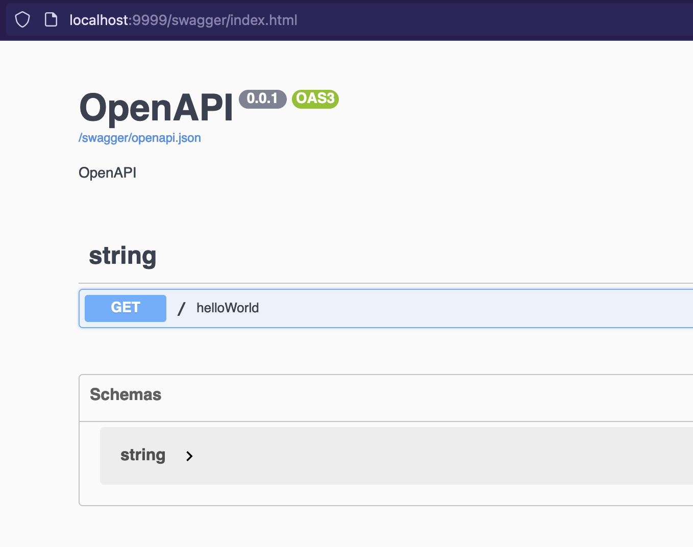

# OpenAPI Specification

Fuego automatically generates an OpenAPI specification for your API.

```go
package main

import (
	"github.com/go-fuego/fuego"
)

func main() {
	s := fuego.NewServer()

	fuego.Get(s, "/", helloWorld)

	s.Run()
}

func helloWorld(c fuego.ContextNoBody) (string, error) {
	return "Hello, World!", nil
}
```

Result for this simple example:



The core idea of Fuego is to generate the OpenAPI specification automatically,
so you don't have to worry about it. However, you can customize it if you want.

## Operations

Each route can be customized to add more information to the OpenAPI specification.

Just add methods after the route declaration.

```go
package main

import (
	"github.com/go-fuego/fuego"
)

func main() {
	s := fuego.NewServer()

	fuego.Get(s, "/", helloWorld).
		Summary("A simple hello world").
		Description("This is a simple hello world").
		Deprecated()

	s.Run()
}

func helloWorld(c fuego.ContextNoBody) (string, error) {
	return "Hello, World!", nil
}

```

## Output

Fuego automatically provides an OpenAPI specification for your API in several ways:

- **JSON file**
- **Swagger UI**
- **JSON endpoint**

Fuego will indicate in a log the paths where the OpenAPI specifications and
Swagger UI are available.

You can customize the paths and to activate or not the feature, with the option `WithOpenAPIConfig`.

```go
package main

import (
	"github.com/go-fuego/fuego"
)

func main() {
	s := fuego.NewServer(fuego.WithOpenAPIConfig(fuego.OpenAPIConfig{
		DisableSwagger   : false, // If true, the server will not serve the swagger ui nor the openapi json spec
		DisableLocalSave : false, // If true, the server will not save the openapi json spec locally
		SwaggerUrl       : "/swagger", // URL to serve the swagger ui
		JsonUrl          : "/swagger/openapi.json", // URL to serve the openapi json spec
		JsonFilePath     : "doc/openapi.json", // Local path to save the openapi json spec
		UIHandler        : DefaultOpenAPIHandler, // Custom UI handler
	}))

	fuego.Get(s, "/", func(c fuego.ContextNoBody) (string, error) {
		return "Hello, World!", nil
	})

	s.Run()
}
```

## Custom UI

Fuego `Server` exposes a `UIHandler` field that enables you
to implement your custom UI.

Example with http swagger:

```go
import (
	"net/http"

	httpSwagger "github.com/swaggo/http-swagger"
)

func openApiHandler(specURL string) http.Handler {
	return httpSwagger.Handler(
		httpSwagger.Layout(httpSwagger.BaseLayout),
		httpSwagger.PersistAuthorization(true),
		httpSwagger.URL(specURL), // The url pointing to API definition
	)
}

func main() {
	s := fuego.NewServer(
		fuego.WithOpenAPIConfig(fuego.OpenAPIConfig{
			UIHandler: openApiHandler("/swagger.json"),
		}),
	)

	fuego.Get(s, "/", helloWorld)

	s.Run()
}
```

The default spec url reference Element Stoplight swagger ui.

Please note that if you embed swagger ui in your build it will increase its size
by more than 10Mb.

|               | StopLight Elements | Swagger        | Disabled |
| ------------- | ------------------ | -------------- | -------- |
| Works offline | No ❌              | Yes ✅         | -        |
| Binary Size   | Smaller            | Larger (+10Mb) | Smaller  |

## Hide From Openapi Spec

Certain routes such as web routes you may not want to be part of the openapi spec.

You can prevent them from being added with the server.Hide().

```go
package main

import (
	"github.com/go-fuego/fuego"
)

func main() {
	s := fuego.NewServer()

	// Create a group of routes to be hidden
	web := s.Group(s, "/")
	web.Hide()

	fuego.Get(web, "/", func(c fuego.ContextNoBody) (string, error) {
		return "Hello, World!", nil
	})

	// These routes will still be added to the spec
	api := s.Group(s, "/api")
	fuego.Get(api, "/hello", func(c fuego.ContextNoBody) (string, error) {
		return "Hello, World!", nil
	})

	s.Run()
}
```
