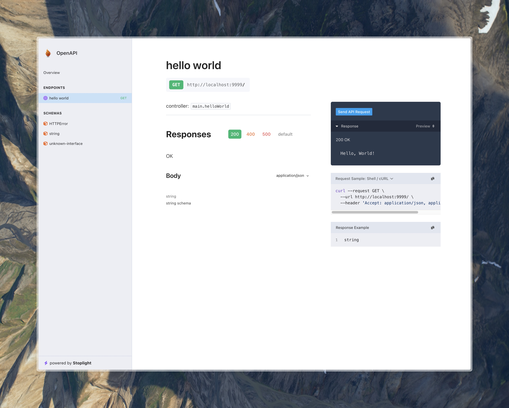

# 🔥 Fuego

<p align="center">
  
</p>

Let's discover **Fuego in less than 5 minutes**.

## Quick peek without installing

Try our [Hello World](./tutorials/01-hello-world.md)!

```bash
go run github.com/go-fuego/fuego/examples/hello-world@latest
```

This simple code snippet runs a 'Hello World' server.
See how much Fuego generates from just a few lines of code!
You'll even get a URL to view the result directly in your browser

```go showLineNumbers
package main

import (
	"github.com/go-fuego/fuego"
)

func main() {
	s := fuego.NewServer()

	fuego.Get(s, "/", helloWorld)

	s.Run()
}

func helloWorld(c fuego.ContextNoBody) (string, error) {
	return "Hello, World!", nil
}
```



## Try examples with real source code in 3 sec

Just copy/paste these commands in your terminal,
you'll be iterating on a real example in no time.

```bash
git clone git@github.com:go-fuego/fuego.git
cd fuego/examples/petstore
go run .
```

### What you'll need

- [Golang v1.22](https://golang.org/doc/go1.22) or above
  _(Fuego relies on a new feature of the net/http package only available after 1.22)_.
