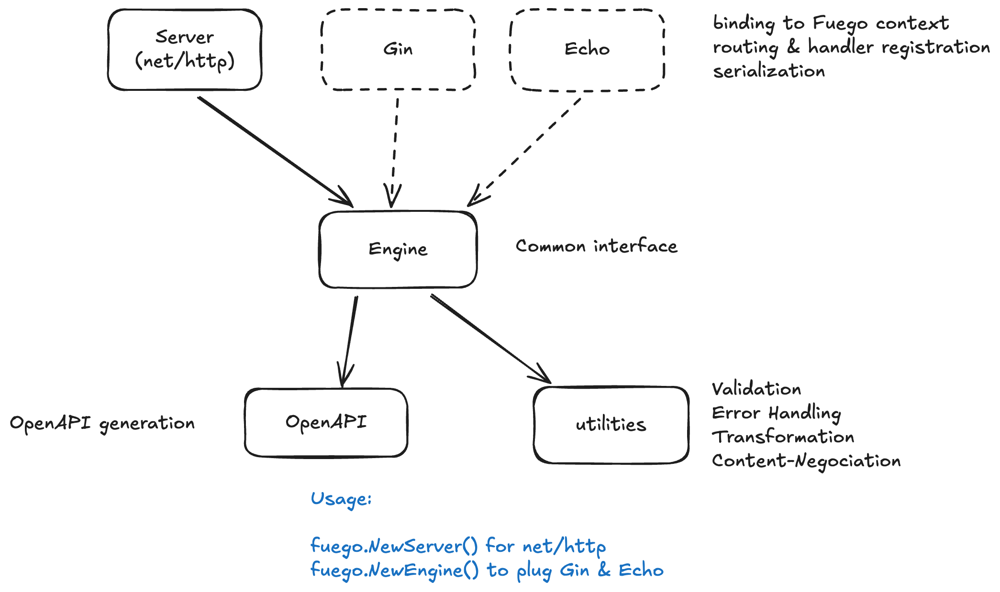

# Architecture

Fuego's architecture rely on the following components:

- **Engine**: The engine is responsible for handling the request and response. It is the core of Fuego.
  - It contains the **OpenAPI** struct with the Description and OpenAPI-related utilities.
  - It also contains the centralized Error Handler.
- **Server**: The default `net/http` server that Fuego uses to listen for incoming requests.
  - Responsible for routes, groups and middlewares.
- **Adaptors**: If you use Gin, Echo, or any other web framework, you can use an adaptor to use Fuego with them.
- **Context**: The context is a generic typed interface that represents the state that the user can access & modify in the controller.

